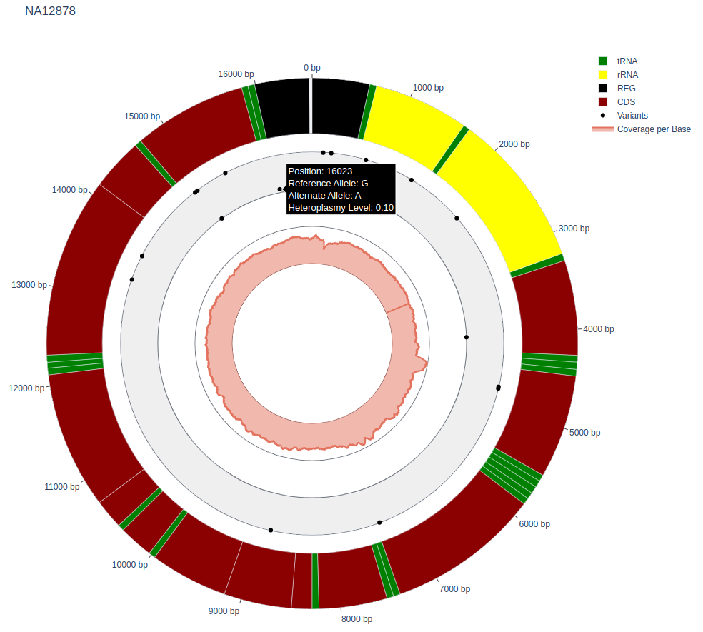
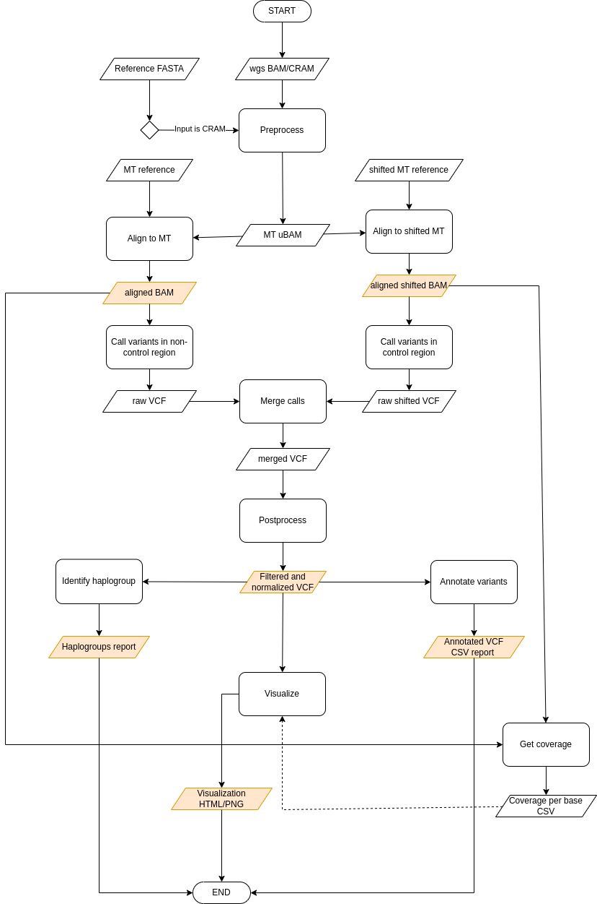

End-to-end pipeline walkthrough
================================

.. Mitochondrial references in human genome assemblies
.. ---------------------------------------------------
.. .. list-table::
..    :widths: 10 10 10
..    :header-rows: 1

..    * - Genome assembly
..      - MT reference
..      - MT contig name
..    * - GRCh38
..      - `rCRS <https://www.ncbi.nlm.nih.gov/nuccore/NC_012920.1>`_
..      - MT
..    * - GRCh37
..      - `rCRS <https://www.ncbi.nlm.nih.gov/nuccore/NC_012920.1>`_
..      - MT
..    * - hs37d5
..      - `rCRS <https://www.ncbi.nlm.nih.gov/nuccore/NC_012920.1>`_
..      - MT
..    * - hg38 (UCSC)
..      - `rCRS <https://www.ncbi.nlm.nih.gov/nuccore/NC_012920.1>`_
..      - chrM
..    * - hg19 (UCSC)
..      - `African Yoruba sequence <https://www.ncbi.nlm.nih.gov/nuccore/NC_001807.4?report=genbank>`_
..      - chrM
..    * - hg19 (UCSC)
..      - `rCRS <https://www.ncbi.nlm.nih.gov/nuccore/NC_012920.1>`_
..      - chrMT

Inputs
-------
WGS alignment file in **BAM** format

.. note::
  The input alignment file should be coordinate-sorted and indexed, however if these prerequisities are not met, mitopy will coordinate-sort and index the input file.

Outputs
--------

Alignments
**********
Alignments (``.bam``) to mitochondrial and shifted mitochondrial reference genomes and their respective index files (``.bai``)

Variants
*********
Postprocessed variant calls (``.vcf``) and index file (``.vcf.idx``)

Annotations
************
Annotated variants (``.vcf``) and annotation report (``.csv``). The annotation CSV report contains following annotation fields:

.. list-table::
   :widths: 20 25 55
   :header-rows: 1
   :class: tight-table

   * - Field
     - Source
     - Description
   * - POS
     - VCF file
     - Postion of the variant
   * - REF
     - VCF file
     - Reference allele
   * - ALT
     - VCF file
     - Alternate allele
   * - Heteroplasmy Fraction
     - VCF file
     - Variant allele fraction (coded as AF in FORMAT field of VCF)
   * - MT Variant Type
     - VCF file
     - Type of the mitochondrial variant based on minimal homoplasmy treshold [homoplasmic/heteroplasmic]
   * - LOCUS
     - `NCBI <https://www.ncbi.nlm.nih.gov/nuccore/251831106>`_
     - Mitochondrial locus/gene where variant is located
   * - BIOTYPE
     - `NCBI <https://www.ncbi.nlm.nih.gov/nuccore/251831106>`_
     - Locus biotype
   * - phastCons100way
     - `PhastCons100way <https://genome.ucsc.edu/cgi-bin/hgc?hgsid=916826631_g8XasCQqrg8t9dxczEQmzhNA9Nyc&c=chr12&l=53858048&r=53859044&o=53858048&t=53859044&g=phastCons100way&i=phastCons100way>`_
     - PhastCons conservation score; range [min 0, max 1] (conserved: score > 0.7)
   * - phyloP100way
     - `PhyloP100way <https://genome.ucsc.edu/cgi-bin/hgc?hgsid=784677241_vYLABfJrjxNKeDTusOROCSUBXtnK&c=chrM&l=0&r=16569&o=0&t=16569&g=phyloP100way&i=phyloP100way>`_
     - PhyloP conservation score; range  [min -20, max 10] (conserved: score > 0)
   * - ClinVar_ID
     - `ClinVar <https://www.ncbi.nlm.nih.gov/clinvar/>`_
     - ClinVar Variation ID
   * - CLNDN
     - `ClinVar <https://www.ncbi.nlm.nih.gov/clinvar/>`_
     - Disease name associated with variant
   * - CLNSIG
     - `ClinVar <https://www.ncbi.nlm.nih.gov/clinvar/>`_
     - Clinical significance for variant
   * - CLNDISDB
     - `ClinVar <https://www.ncbi.nlm.nih.gov/clinvar/>`_
     - Disease database name and identifier for variant
   * - GNOMAD_AC_HOM
     - `gnomAD <https://gnomad.broadinstitute.org/downloads#v3-mitochondrial-dna>`_
     - Gnomad allele count restricted to variants with a heteroplasmy level >= 0.95
   * - GNOMAD_AF_HOM
     - `gnomAD <https://gnomad.broadinstitute.org/downloads#v3-mitochondrial-dna>`_
     - Gnomad allele frequency restricted to variants with a heteroplasmy level >= 0.95
   * - GNOMAD_AF_HET
     - `gnomAD <https://gnomad.broadinstitute.org/downloads#v3-mitochondrial-dna>`_
     - Gnomad allele frequency restricted to variants with a heteroplasmy level >= 0.10 and < 0.95
   * - GNOMAD_AC_HET
     - `gnomAD <https://gnomad.broadinstitute.org/downloads#v3-mitochondrial-dna>`_
     - Gnomad allele count restricted to variants with a heteroplasmy level >= 0.10 and < 0.95
   * - MitoTIP_Score
     - `MitoTIP <https://www.mitomap.org/MITOMAP/MitoTipInfo>`_
     - tRNA raw pathogenicity score from Mitotip
   * - MitoTIP_Prediction
     - `MitoTIP <https://www.mitomap.org/MITOMAP/MitoTipInfo>`_
     - tRNA pathogenicity classification from Mitotip
   * - PONmttRNA_Probability
     - `PON-mt-tRNA <http://structure.bmc.lu.se/PON-mt-tRNA/datasets.html/>`_
     - tRNA probability of pathogenicity from PON-mt-tRNA
   * - PONmttRNA_Prediction
     - `PON-mt-tRNA <http://structure.bmc.lu.se/PON-mt-tRNA/datasets.html/>`_
     - tRNA pathogenicity classification from PON-mt-tRNA
   * - SIFT
     - `SIFT <https://sift.bii.a-star.edu.sg/sift4g/>`__
     - Pathogenicity classification from SIFT
   * - SIFT_score
     - `SIFT <https://sift.bii.a-star.edu.sg/sift4g/>`__
     - Pathogenicity prediction score from SIFT
   * - MITOMAP_GENBANK_AC
     - `MITOMAP <https://www.mitomap.org/MITOMAP>`_
     - Allele count in GenBank out of 61168 full length (FL) human chrM sequences
   * - MITOMAP_GENBANK_AF
     - `MITOMAP <https://www.mitomap.org/MITOMAP>`_
     - Allele Frequency in full length (FL) Genbank sequence set
   * - MITOMAP_PubmedIDs
     - `MITOMAP <https://www.mitomap.org/MITOMAP>`_
     - Pubmed IDs
   * - MITOMAP_Disease
     - `MITOMAP <https://www.mitomap.org/MITOMAP>`_
     - Putative Disease Association
   * - MITOMAP_DiseaseStatus
     - `MITOMAP <https://www.mitomap.org/MITOMAP>`_
     - Disease Association Status
   * - SnpEff_EFFECT
     - `SnpEff <http://pcingola.github.io/SnpEff/snpeff/introduction/>`__
     - Functional effect of the variant (annotated using Sequence Ontology terms)
   * - SnpEff_IMPACT
     - `SnpEff <http://pcingola.github.io/SnpEff/snpeff/introduction/>`__
     - A simple estimation of putative impact / deleteriousness: [HIGH, MODERATE, LOW, MODIFIER]
   * - SnpEff_IMPACT
     - `SnpEff <http://pcingola.github.io/SnpEff/snpeff/introduction/>`__
     - Functional effect of the variant (annotated using Sequence Ontology terms)
   * - SnpEff_GENE
     - `SnpEff <http://pcingola.github.io/SnpEff/snpeff/introduction/>`__
     - Common gene name (HGNC). Optional: use closest gene when the variant is "intergenic"
   * - SnpEff_GENEID
     - `SnpEff <http://pcingola.github.io/SnpEff/snpeff/introduction/>`__
     - Gene ID
   * - SnpEff_FEATURE
     - `SnpEff <http://pcingola.github.io/SnpEff/snpeff/introduction/>`__
     - Type of feature (e.g. transcript, motif, miRNA, etc.)
   * - SnpEff_FEATUREID
     - `SnpEff <http://pcingola.github.io/SnpEff/snpeff/introduction/>`__
     - Depending on the annotation, this may be: Transcript ID, Motif ID, etc. 
   * - SnpEff_BIOTYPE
     - `SnpEff <http://pcingola.github.io/SnpEff/snpeff/introduction/>`__
     - Transcript biotype
   * - SnpEff_HGVS_C
     - `SnpEff <http://pcingola.github.io/SnpEff/snpeff/introduction/>`__
     - Variant using HGVS notation (DNA level)
   * - SnpEff_HGVS_P
     - `SnpEff <http://pcingola.github.io/SnpEff/snpeff/introduction/>`__
     - HGVS notation (Protein level) - if variant is coding

Visualization
**************
An interactive visualization (``.html``) of variants at their positions in the mitochondrial circular genome. The basic information about variant are included on hover (e.g. postion, reference allele, alternate allele). 
The variant is visualized in the inner trace at different levels depending on its heteroplasmy fraction (the closer to outer border, the higher heteroplasmy fraction).
Additionally, the calculated coverage is visualized in the innermost trace.

Example: 

Haplogroup
***********

Haplogroup classification report containing information on identified haplogroup (``.txt``)

Proccess
--------

**Preprocessing**
*****************

The input WGS BAM file is first subsetted to include only reads mapped to the mitochondrial genome using `gatk PrintReads <https://gatk.broadinstitute.org/hc/en-us/articles/360036883571-PrintReads>`_ tool. Consequently, the extracted mitochondrial reads are unaligned using `Picard RevertSam <https://gatk.broadinstitute.org/hc/en-us/articles/360037226952-RevertSam-Picard->`_ tool, producing unmapped BAM.
The unalignment step is necessary, since the following stage of the pipeline performs realignment of reads to mitochondrial reference genome.

**Alignment to mitochondrial genome using double alignment strategy**
**********************************************************************

Prior to performing alignment, the unaligned mitochondrial reads in uBAM format have to be converted to FASTQ format required by the aligner.

The unaligned mitochondrial reads (FASTQ) are then realigned to mitochondrial reference and the shifted version of mitochondrial reference using `bwa-mem2 <https://github.com/bwa-mem2/bwa-mem2>`_ aligner. The purpose of double alignment strategy is to increase alignment precision in mitochondrial control region (D-loop).
The shifted reference was created by shifting the original reference by 8000 bases, which moves the breakpoint of the mitochondrial genome from the control region to the opposite side of the contig, allowing reads originating from control region to align precisely.

During to conversion of uBAM to FASTQ, certain useful information from the uBAM are lost. In order to preserve this information and pass to downstream steps, the unmapped BAM is merged with SAM file produced by the aligner using `Picard MergeBamAlignment <https://gatk.broadinstitute.org/hc/en-us/articles/360057439611-MergeBamAlignment-Picard->`_ tool.

Duplicates are marked and alignment files are sorted by coordinate using `gatk MarkDuplicatesSpark <https://gatk.broadinstitute.org/hc/en-us/articles/360037224932-MarkDuplicatesSpark>`_.

**Variant Calling**
********************

Mitochondrial variants are called separately for non-control region using reads aligned to canonical reference and control region using reads aligned to shifted reference.
Variants are called using a somatic variant caller `gatk Mutect2 <https://gatk.broadinstitute.org/hc/en-us/articles/360037593851-Mutect2>`_ in mitochondria mode.

**Merging variant calls**
**************************

After calling variants separately for control and non-control region of mitochondrial genome, the variant calls from both regions have to be merged.

The variants in the control region were called against shifted mitochondrial reference, and thus have to be shifted back to coordinates of canonical reference sequence using `Picard LiftoverVcf <https://gatk.broadinstitute.org/hc/en-us/articles/360037060932-LiftoverVcf-Picard->`_.

The VCF file and shifted-back VCF file are then merged using `Picatd MergeVcfs <https://gatk.broadinstitute.org/hc/en-us/articles/360036713331-MergeVcfs-Picard->`_. Additionally, VCF stats files generated by Mutect2 are merged using
gatk MergeMutectStats. 

**Postprocessing** 
******************

The raw variant calls are postprocessed, applying several filters to remove potential false positive calls and normalizing variant calls to achieve standardized representation. 

The initial filtering phase includes filtering variants based on multiple specified parameters using `gatk FilterMutectCalls <https://gatk.broadinstitute.org/hc/en-us/articles/360036856831-FilterMutectCalls>`_ tool specifically designed for filtering of raw Mutect2 calls. 
Optionally, the variants are filtered based on estimated contamination level. To estimate the level of contamination in mitochondrial DNA sample, we utilize `haplocheck <https://mitoverse.readthedocs.io/haplocheck/haplocheck/>`_.

The next level of filters eliminates common artifacts, i.e. variants overlapping known artifact-prone mitochondrial sites. Finally, an optional last filtering phase involves filering out potential NuMTs based on median autosomal coverage using `gatk NuMTFilterTool`. 
The median autosomal coverage can be estimated from input WGS BAM using `Picard CollectWgsmetrics <https://gatk.broadinstitute.org/hc/en-us/articles/360036804671-CollectWgsMetrics-Picard->`_.

The normalization of variant calls includes left alignment and splitting multi-allelic sites using `gatk LeftAlignAndTrimVariants <https://gatk.broadinstitute.org/hc/en-us/articles/360037225872-LeftAlignAndTrimVariants>`_.

**Calculating coverage**
*************************

The per-base coverage is calculated using `mosdepth <https://github.com/brentp/mosdepth>`_ from canonical and shifted alignments. The resulting per-base coverage is produced by combining coverage from non-control region (canonical alignment) and control region (shifted alignment). 

**Annotation**
***************

The postprocessed variants are annotated with functional effects using `SnpEff <http://pcingola.github.io/SnpEff/>`_ and additional information:

* conservation scores (`PhyloP100way <https://genome.ucsc.edu/cgi-bin/hgc?hgsid=784677241_vYLABfJrjxNKeDTusOROCSUBXtnK&c=chrM&l=0&r=16569&o=0&t=16569&g=phyloP100way&i=phyloP100way>`_ and `PhastCons100way <https://genome.ucsc.edu/cgi-bin/hgc?hgsid=916826631_g8XasCQqrg8t9dxczEQmzhNA9Nyc&c=chr12&l=53858048&r=53859044&o=53858048&t=53859044&g=phastCons100way&i=phastCons100way>`_)
* population frequencies (`gnomAD <https://gnomad.broadinstitute.org/downloads#v3-mitochondrial-dna>`_)
* in-silico pathogenicity predictions (`SIFT <https://sift.bii.a-star.edu.sg/>`_, `MitoTIP <https://www.mitomap.org/MITOMAP/MitoTipInfo>`_ and `PON-mt-tRNA <http://structure.bmc.lu.se/PON-mt-tRNA/datasets.html/>`_)
* phenotype associations (`MITOMAP <https://www.mitomap.org/MITOMAP>`_ and `ClinVar <https://www.ncbi.nlm.nih.gov/clinvar/>`_)

Additionally the variants are annotated as heteroplasmic (0/1 genotype) or homoplasmic (1/1 genotype) based on specified treshold. 

The annotations are exported to human-readable CSV format. See TODO for description of individual fields.

**Visualization**
*****************

An interactive HTML visualization of variants is created, visualizing variants at their positions within mitochondrial genome. The calculated coverage is included in the plot.

**Identifying haplogroups**
****************************

The haplogroup of the sample is identified based on detected variants using `haplogrep3 <https://haplogrep.readthedocs.io/en/latest/>`_.
